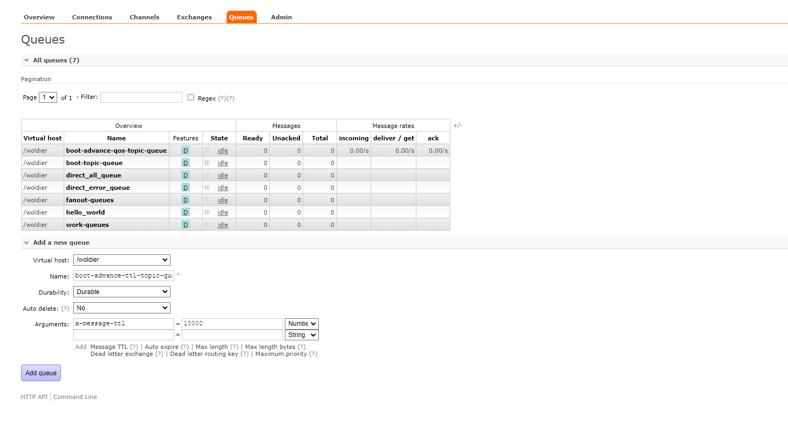
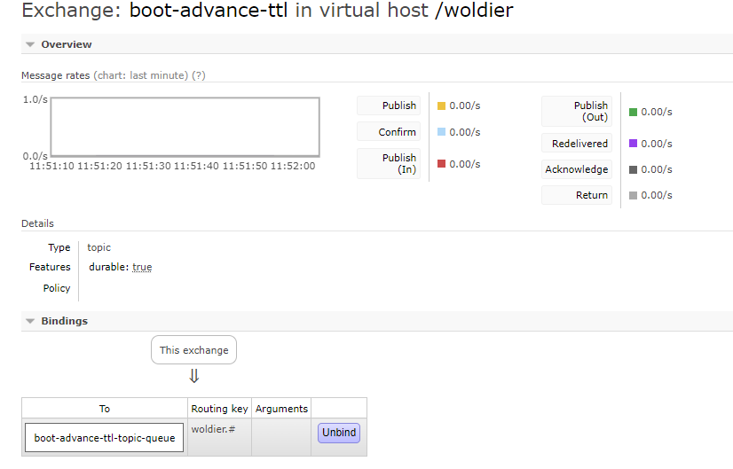

TTL

➢ TTL 全称 Time To Live（存活时间/过期时间）。 \
➢ 当消息到达存活时间后，还没有被消费，会被自动清除。 \
➢ RabbitMQ可以对消息设置过期时间，也可以对整个队列（Queue）设置过期时间。 

- 设置队列过期时间使用参数：x-message-ttl，单位：ms(毫秒)，会对整个队列消息统一过期。

- 设置消息过期时间使用参数：expiration。单位：ms(毫秒)，当该消息在队列头部时（消费时），会单独判断
这一消息是否过期。

- ## 如果两者都进行了设置，以时间短的为准。


# 1. 设置队列过期时间
## 1.1 通过控制台进行

设置queue名字为 boot-advance-ttl-topic-queue
设置参数 x-message-ttl 为10000ms

设置exchange boot-advance-ttl-topic-queue"

并且绑定 


## 1.2 通过code设置
先在web管理界面删除exchange 和queue 
方便测试

在声明队列是 设置了`withArgument("x-message-ttl",TTL_EXPIRATION)` 来给定ttl
```java
package com.woldier.config;

import org.springframework.amqp.core.*;
import org.springframework.beans.factory.annotation.Qualifier;
import org.springframework.context.annotation.Bean;
import org.springframework.context.annotation.Configuration;

/**
 * 消息可靠传递所使用的队列及交换机的声明与绑定
 */
@Configuration
public class PublisherConfirmConfig {
    public static final String EXCHANGE_NAME = "boot-advance-ttl";
    public static final String QUEUE_NAME = "boot-advance-ttl-topic-queue";
    private static final String ROUTING_KEY = "woldier.#";
    //ttl时间(毫秒)
    private static final int TTL_EXPIRATION = 10000;
    /**
     * 交换机
     */
    @Bean("bootExchange")
    public Exchange bootExchange(){
        return ExchangeBuilder.topicExchange(EXCHANGE_NAME).durable(true).build();
    }
    /**
     * 队列 ,
     */
    @Bean("bootQueue") //Bean没有指定名字 则默认为方法名
    public Queue bootQueue(){
        /**
         * 设置过期参数
         */
        return QueueBuilder.durable(QUEUE_NAME).withArgument("x-message-ttl",TTL_EXPIRATION).build();
    }
    /**
     * 绑定
     */

    @Bean
    public Binding bindQueue2Exchange(
            @Qualifier("bootExchange") Exchange bootExchange, //若容器中有多个exchange可以使用变量名代表要注入哪一个
            @Qualifier("bootQueue") Queue queue //也可以使用@Qualifier指定
    ){
        /*绑定并设置路由信息*/
        return BindingBuilder.bind(queue).to(bootExchange).with(ROUTING_KEY).noargs();
    }
}

```
 尝试一下发送消息后重新设置TTL 为更大的 看看会不会队列信息会不会更新
 `    private static final int TTL_EXPIRATION = 55000;`
 经过测试 发现 会报错,
 ```log
 queue 'boot-advance-ttl-topic-queue' in vhost '/woldier': received '55000' but current is '10000', class-id=50
 ```
解决办法 可以是在web管理界面中删除现有的queue再创建

# 2 设置消息过期时间
## 2.1 发送请求
## 2.2 添加MessagePostProcessor实现类 实现其中的方法

```java
 @Test
    public void test2() throws InterruptedException {
            //rabbitTemplate.convertAndSend(EXCHANGE_NAME,"woldier.ttl","hello  ttl ");
        /**
         * 发送消息 实现postMessagePostProcessor中的方法
         */
        rabbitTemplate.convertAndSend(EXCHANGE_NAME, "woldier.ttl", "hello  ttl ", new MessagePostProcessor() {
            @Override
            public Message postProcessMessage(Message message) throws AmqpException {
                /*设置过期时间*/
                message.getMessageProperties().setExpiration("5000");
                return message;
            }
        });

    }
```